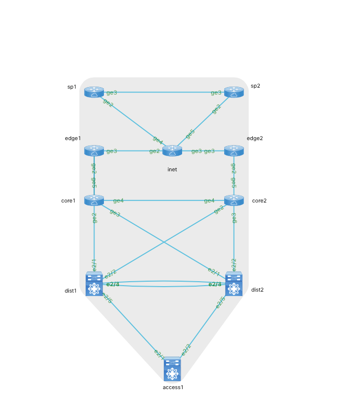

# Change Validation Demo

This demo shows how PyATS and Genie CLI can be used to validate changes made through model driven programmability. 

In this demo we will use a Python script to modify the routing policy and then validate that our script had the intended effect using pyATS Library (formerly Genie). pyATS enables network engineers to automate their day-to-day DevOps activities, perform stateful validation of their device operational status, and build a safety net of scaleable, data-driven and reusable test cases around the network.

[Oh and it's free.](https://developer.cisco.com/pyats/) 


## Demo Prepration

The network topology for this demo was built using Cisco VIRL a network simulation platform. If you do not have your own VIRL server available you the demo was written and tested using [DevNet Sandbox Multi-IOS Test Network](https://devnetsandbox.cisco.com/RM/Diagram/Index/6b023525-4e7f-4755-81ae-05ac500d464a?diagramType=Topology) and you are encouraged to reserve a free instance of this lab. 

Before starting the lab update the ```srv_env.template``` file with the IP address, username and password used to access your instance of VIRL and source the file. Once complete start the VIRL instance with ```virl up```

If you are running this out of the Multi-IOS Sandbox your srv_env.template file should look like this:

```
export VIRL_HOST=10.10.20.160
export VIRL_USERNAME=guest
export VIRL_PASSWORD=guest
export PYATS_PASSWORD=cisco
export PYATS_AUTH_PASS=cisco
export PYATS_USERNAME=cisco
```

Finally generate the inventory file to be used by pyATS.

```virl generate pyats```

## The Environment

The topology for this demo is:




The topology simulates a typical dual Internet edge design. The core routers (core1/core2) are peering BGP with two different Service Providers represented by edge1/edge2. The sp1/sp2 routers are originating routes and advertising towards the core.

**SP1 Routes**

```
65.249.16.0/24
65.249.17.0/24
65.249.18.0/24
65.249.19.0/24
```

**SP2 Routes**

```
209.154.128.0/24
209.154.129.0/24
209.154.130.0/24
209.154.131.0/24
```

The routes from the "Internet" are being redistributed into OSPF. The dist1/dist2 switches see all "Internet" routes through ECMP through core1/core2 respectively. 

In the demo we will use a Python script to have traffic destined to the 209.154.1xx.0 networks prefer the egress point on core2. We will create a prefix list and modify the local preference.

### Step 1 - Generating the Network Baseline

Before we modify the BGP policy we need to baseline the network. We will do this by learning the current tables on all devices in the network. 

```
genie learn routing --testbed default_testbed.yaml --output tests/baseline
```

After running the command pyATS will log into the devices and run a series of cli level commands for BGP, OSFP and routing. The output of those commands will be saved off to text files in the tests/baseline directory. For each device in the network there are two associated files. The files ending in 'console' are the actual console outputs of the commands. The files ending in ops are JSON structured outputs of the console commands. Open up a few up and take a look.

```
cat tests/baseline/routing_iosxe_core1_console.txt
cat tests/baseline/routing_iosxe_core1_ops.txt
```

### Step 2 - Modifying the Local Preference

Now we will our Python script to modify the local preference. Let's look at the code

```
cat 1_set_local_pref.py
```

As you can see in the code we are reading in YAML formatted device details. Let's look at what's included in that file

```
cat device_details.yaml

---
devices:

  - name: core2
    device_type: 'cisco_ios'
    ip: '172.16.30.164'
    username: 'cisco'
    password: 'cisco'
    prefix_name: PREF_EDGE2
    prefixes:
      - seq: 100
        action: permit
        prefix: 209.154.128.0
        len: 22
        keyword: min
        min: 24
        max:
    route_map:
      name: INBOUND
      map_seq:
        - seq: 116
          prefix_match: PREF_EDGE2
```

The YAML file includes all the relevant details we need to define a prefix-list named PREF_EDGE2, that matches on all /24s that are part of the 209.154.128.0/22 prefix. Additionally details are included for matching on the prefix-list name and setting the local preference.

Next the code will read in [Jinja Templates](http://jinja.pocoo.org) which will be used to build the XML payload delivered by ncclient.

Let's run the code

**_Note_** - Before running the code issue a ```virl nodes``` and set the IP address of core2 in the device_details.yaml file. If the script returns back a sockets error you have supplied the wrong IP address.

```
python 1_set_local_pref.py
```

### Step 3 - Validating the Change

After making our routing change on the network lets relearn the state of our routing.

```
genie learn bgp ospf routing --testbed default_testbed.yaml --output tests/postchange
```

We now have two sets of data we can compare. Genie gives us the ability to generate diffs.

```
genie diff tests/baseline tests/postchange --output tests/diff
```

The output will match something similar to what's below

```
|------------------------------------------------------------------------------|
|  File: routing_nxos_dist1_ops.txt                                            |
|   - Diff can be found at tests/diff/diff_routing_nxos_dist1_ops.txt          |
|------------------------------------------------------------------------------|
|  File: routing_iosxe_inet_ops.txt                                            |
|   - Diff can be found at tests/diff/diff_routing_iosxe_inet_ops.txt          |
|------------------------------------------------------------------------------|
|  File: routing_iosxe_sp1_ops.txt                                             |
|   - Diff can be found at tests/diff/diff_routing_iosxe_sp1_ops.txt           |
|------------------------------------------------------------------------------|
|  File: routing_nxos_access1_ops.txt                                          |
|   - Diff can be found at tests/diff/diff_routing_nxos_access1_ops.txt        |
|------------------------------------------------------------------------------|
|  File: routing_iosxe_core1_ops.txt                                           |
|   - Diff can be found at tests/diff/diff_routing_iosxe_core1_ops.txt         |
|------------------------------------------------------------------------------|

```

As we can see certain features are reporting differences in the state. Let's open up one of the files in our editor of choice and look at the output.

```
cat tests/diff/diff_routing_iosxe_core1_ops.txt 
```

Search through the output and look for the route entry for 209.154.128.0. It should match the following:

```
      209.154.128.0/24:
+       metric: 1
-       metric: 0
       next_hop:
        next_hop_list:
         1:
+          outgoing_interface: GigabitEthernet4
+          next_hop: 10.0.0.2
-          next_hop: 10.0.3.2
+          updated: 00:01:03
-          updated: 00:06:21
+       route_preference: 110
-       route_preference: 20
+       source_protocol: ospf
-       source_protocol: bgp
+       source_protocol_codes: O E2
-       source_protocol_codes: B
```

What this output shows us is result of the diff. For items with a leading '+' these are added and for items leading with a '-' they were taken away. From this output we can see:

- The route to 209.154.128.0/24 is now through the interface that attaches to core2 (10.0.0.2)
- The route preference is now 110 (OSPF) when it was previously 20 (BGP).

You can investigate any of the other devices in the topology by viewing the result in the tests/diff directory.

## Demo Clean Up

To shut down the demo run 

```
virl down
```